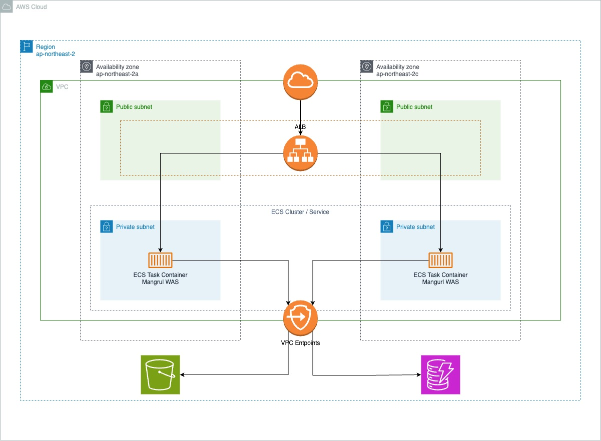

# mangurl

## TL;DR

- URL 단축 서비스입니다.
- ~~[여기](https://mangurl.net)에서 사용할 수 있습니다.~~
- 다른 기술 스택으로 변경중입니다. 현재 셔비스를 사용할 수 없습니다.

## 프로젝트 구조

```text
  .
  ├── src
  │   ├── main
  │   │   ├── java/.../mangurl
  │   │   │   ├── application
  │   │   │   ├── inboundadapter
  │   │   │   ├── outboundadapter
  │   │   │   ├── config
  │   │   │   ├── lib
  │   │   │   └── MangurlApplication.java
  │   │   └── resources
  │   │       ├── mangurl
  │   │       ├── templates/app.html
  │   │       └── application.yml
  │   └── test/java/.../mangurl
  ├── docker
  ├── .github/workflows
  └── build.gradle
```

- `src/main/java/.../mangurl/application`: 도메인 모듈을 담당합니다. 도메인 모듈은 외부와 주고받는 메시지를 모두 인터페이스로 선언해야 합니다.
  ```text
    application
    └── url  # 단축 URL을 만들고 원본 URL을 찾는 역할을 담당하는 모듈입니다.
        ├── inboundport   # 외부에서 도메인 모듈과 협력하기 위한 메시지 인터페이스를 담당하는 모듈입니다.
        ├── service       # inbound port로 선언한 인터페이스 구현을 담당하는 모듈입니다.
        └── outboundport  # 도메인 모듈에서 외부 객체와 협력하기 위한 메시지 인터페이스를 담당하는 모듈입니다.
  ```
- `src/main/java/.../mangurl/inboundadapter`: 외부 입력을 받아 도메인 서비스를 호출하는 컨트롤러를 담당하는 모듈입니다.
  ```text
    inboundadapter
    ├── api       # REST API 컨트롤러를 담당하는 모듈입니다.
    ├── app       # 웹 클라이언트용 컨트롤러를 담당하는 모듈입니다.
    └── shorturl  # 단축 URL을 리다이렉트하는 컨트롤러를 담당하는 모듈입니다.
  ```
- `src/main/java/.../mangurl/outboundadapter`: `outboundport` 구현체를 담당하는 모듈입니다.
- `src/main/java/.../mangurl/config`: 설정 객체를 담당하는 모듈입니다.
- `src/main/java/.../mangurl/lib`: 외부 라이브러리 객체를 담당하는 모듈입니다.
- `src/main/java/.../mangurl/MangurlApplication.java`: 메인 메소드를 선언한 메인 클래스입니다.
- `src/main/resources/mangurl`: 개별 설정 파일을 보관합니다. 설정 파일은 YAML 형식으로 작성합니다.
- `src/main/resources/templates/app.html`: 웹 클라이언트 페이지입니다.
- `src/main/resources/application.yml`: 프로젝트 루트 설정 파일입니다. Profile을 선언하고 개별 설정 파일을 연결합니다.
- `src/test/java/.../mangurl`: 단위 테스트를 담당하는 모듈입니다.
- `docker`: 도커 컴포즈 설정 파일을 보관합니다. 필요한 환경을 디렉터리로 만들고 디렉터리 안에 `compose.yaml` 파일을 만듭니다.
  ```text
    docker
    ├── local
    │   └── compose.yaml
    └── local-container
        └── compose.yaml
  ```
- `.github/workflows`: GitHub Action에서 실행할 Workflow를 선언한 파일을 보관합니다.
  ```text
    .github/workflows
    ├── deploy.yml    # 도커 이미지를 빌드하고 AWS ECR에 푸시합니다.
    └── pr-check.yml  # GitHub PR이 열리면 단위 테스트를 실행합니다.
  ```
- `build.gradle`: Gradle 빌드 설정 파일입니다. 디펜던시 목록을 추가하거나 Task 설정을 편집할 수 있습니다.

## 시스템 구성



## 개발 규칙

- `main` 브랜치는 항상 실행할 수 있는 상태를 유지합니다.
- 코드 변경은 항상 브랜치를 생성하여 작업한 후 GitHub PR을 통해 `main` 브랜치에 병합합니다.

## 개발 환경 구축 및 실행

- JDK 17 이 필요합니다. [이곳](https://adoptium.net/temurin/releases/?version=17)에서 다운받아 설치하거나 편한 방법으로 설치해 주세요.
- DynamoDB에 연결하거나 도커 이미지를 빌드하기 위해 도커가 필요합니다. [가이드](https://docs.docker.com/engine/install/)에서 자기 환경에 맞는 방법에 따라 설치해 주세요.

Gradle Wrapper를 사용하기 때문에 Gradle 을 직접 설치할 필요가 없습니다. 프로젝트 루트 경로에서 아래 명령어를 사용할 수 있습니다.

- 실행
  ```shell
  ./gradlew bootRun
  ```
- 테스트
  ```shell
  ./gradlew test
  ```
- 빌드
  ```shell
  ./gradlew bootJar
  ```
  이후 아래 명령어로 실행할 수 있습니다.
  ```shell
  java -jar ./build/libs/mangurl-<version>.jar
  ```
- 도커 이미지 빌드
  ```shell
  ./gradlew bootBuildImage
  ```

Spring Profile 설정

- `src/main/resources/application.yml` 의 `spring.profiles.active` 항목을 원하는 profile로 변경합니다.
- 실행할 때 `SPRING_PROFILES_ACTIVE` 환경변수에 원하는 profile을 설정합니다.
  ```shell
  SPRING_PROFILES_ACTIVE=dev ./gradlew bootRun
  ``` 

지원하는 Profile

- `local`: 로컬에서 개발할 때 사용합니다. `http://localhost:8000` 에 로컬 DynamoDB가 실행 중이어야 합니다.
  `docker/local/compose.yaml` 로 실행할 수 있습니다.
- `local-container`: 빌드한 도커 이미지를 로컬에서 실행할 때 사용합니다.
  `docker/local-container/compose.yaml` 로 실행할 수 있습니다.
- `test`: 테스트할 때 사용합니다.
- `dev`: 개발용 DynamoDB에 연결할 때 사용합니다. AWS IAM Credentials 가 필요합니다. 담당자에게 문의하세요.
- `prod`: 프로덕션 환경에서 사용합니다. 해당 Profile 파일은 접근이 제한된 S3에 보관합니다.

로컬 DynamoDB

- DynamoDB는 도커를 사용해 로컬에서 실행할 수 있습니다.
- 실행
  ```shell
  cd docker/<profile>
  docker compose up
  ```
- 종료
  ```shell
  cd docker/<profile>
  docker compose down
  ```

## 테스트 전략

- 단위 테스트와 통합 테스트(예정)를 진행합니다.
- PR을 생성하면 자동으로 GitHub Action 에서 단위 테스트를 실행합니다. 테스트 결과는 PR에 자동으로 기록됩니다. 테스트를 통과해야 머지할 수 있습니다.

단위 테스트

- 실행
  ```shell
  ./gradlew test
  ```
- 객체의 가장 작은 책임 단위로 작성합니다.
- Spring에 의존하지 않게 작성합니다.

통합 테스트 (예정)

- 커스텀 Gradle Task를 생성할 예정입니다.
- 통합 테스트 Task는 verify에 포함될 예정입니다.
- 릴리즈 과정에서 실행할 예정입니다.

## 배포

DEPLOY GitHub Action으로 배포할 수 있습니다. Action 실행 권한이 필요한 경우 담당자에게 문의하세요.

AWS ECR에 푸시할 수 있는 AWS IAM Credentials가 있다면 로컬에서 도커 이미지를 빌드해서 직접 푸시할 수 있습니다. 도커와 AWS CLI 가 필요합니다.

- `src/main/resources/mangurl/` 아래의 모든 설정 파일을 삭제해주세요.
  공통 설정인 `application.yml`을 제외하고 도커 이미지에 직접 설정 파일이 포함되지 않게 주의해주세요.
- AWS CLI를 사용해 AWS ECR에 대해 도커 클라이언트를 인증합니다.
  ```shell
  aws ecr get-login-password --region <region> --profile <profile> | docker login --username AWS --password-stdin <ecr 주소>
  ```
- 도커 이미지를 빌드합니다. AWS ECR에 맞는 태그를 추가로 설정합니다.
  ```shell
  ./gradlew bootBuildImage -Ptag=<ecr 주소/ecr 리포지토리 이름:프로젝트 버전>
  ```
  현재 프로젝트 버전은 아래 명령어로 출력할 수 있습니다.
  ```shell
  ./gradlew -q printVersion
  ```
- 빌드한 도커 이미지를 AWS ECR에 푸시합니다.
  ```shell
  docker push <빌드한 도커 이미지 이름:버전>
  ```

## API 엔드포인트 목록 및 사용

[Swagger 문서](https://mangurl.net/api/swagger-ui/index.html)로 API 사용법을 제공하고 있습니다.

단축 URL 사용

- 브라우저 주소창에 생성한 단축 URL 주소를 입력해주세요. 또는 가장 편한 방법으로 단축 URL로 HTTP 요청을 보내주세요.
- 단축 URL에 대한 응답 코드는 `302 Found` 입니다. 원본 URL은 `Location` 헤더에서 확인할 수 있습니다.
- 등록되지 않은 단축 URL에 대해서는 `404 Not Found` 코드를 응답합니다.

<!-- @TODO
## 참고자료
회고 또는 블로그 포스팅
-->
